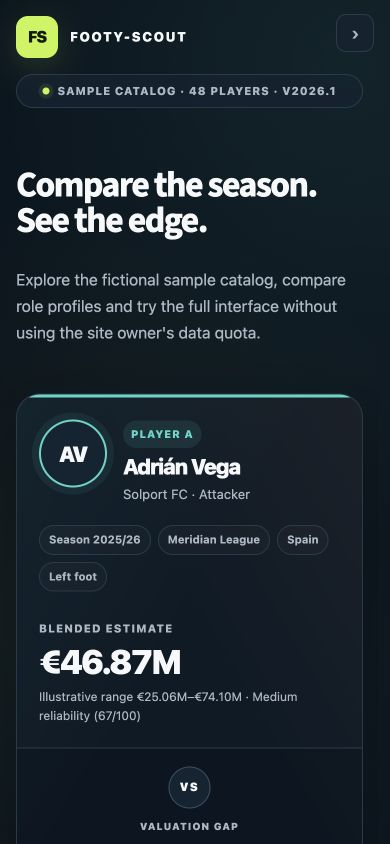

# Footy-Scout

[](https://github.com/longinhk/footballscout/actions/workflows/test.yml)

[](LICENSE)

Footy-Scout is a Streamlit workspace for finding real football players and
comparing their season statistics. Visitors search by full name or surname, choose two
profiles and load a season into the same responsive scouting canvas.

The app also includes a clearly labelled catalog of 48 fictional players. That
sample mode works without an API key and lets people explore the interface when
the live data service is unavailable or its daily allowance has been reached.

<p align="center">
  
  
</p>

## What it includes

- Global real-player profile search powered by API-Football
- Full-name fallback search with accent handling, ranked results and explicit player IDs
- Provider-supported season choices, profile filters and honest coverage notes
- Season statistics aggregated across the player's teams and competitions
- Side-by-side summaries, real-data comparison profiles and position-aware per-90 views
- Three transparent educational valuation methods with reliability ranges
- Shareable real-player comparison URLs
- Portable real-player favourites for later comparisons and fantasy squads
- A Fantasy Challenge with visible prices, comparison-to-squad seeding,
  persistent selections, 1–8 players, a €100M budget, captains and a session leaderboard
- PDF and CSV comparison exports
- A fictional sample catalog with filters, watchlists and portable workspaces
- Responsive and keyboard-friendly controls for desktop and mobile

API coverage varies by player, competition and season. Valuations are
illustrative estimates, not official market values, recruitment recommendations
or financial advice.

## API setup

Create an API-Football account and copy your key from the dashboard. The free
plan currently provides a limited daily request allowance, so this app caches
profile searches for 12 hours, season statistics for 6 hours and available
seasons for 24 hours. A small disk cache preserves responses across local app
restarts and never stores the API key. Idempotent provider calls retry short
429/502/503/504 outages with bounded backoff. If the provider is unavailable,
an expired cached response can be served with a visible warning instead of
taking the whole real-player workflow offline.

The app limits repeated searches within one browser session and pauses new live
searches when the last account check reports five or fewer requests remaining.
The interface then directs visitors to the complete Sample catalog. Allowance
labels are deliberately described as **last checked** or **last observed**
because cached provider headers are not guaranteed to be live.

API-Football currently limits free-plan player statistics to seasons 2022–2024.
Footy-Scout detects the account plan and only offers those seasons to free-plan
users, avoiding a request that the provider would reject with HTTP 403.

For local use:

```bash
cp .streamlit/secrets.example.toml .streamlit/secrets.toml
chmod 600 .streamlit/secrets.toml
```

Then replace the placeholder in `.streamlit/secrets.toml`:

```toml
API_FOOTBALL_KEY = "your-private-key"
```

For Streamlit Community Cloud, open the app's **Settings → Secrets** and add the
same TOML value. Never commit `.streamlit/secrets.toml`; it is already ignored by
Git. Visitors do not enter the key, and it is never rendered in the interface.

Legacy RapidAPI accounts may set `RAPIDAPI_KEY` instead.

## Run locally

Python 3.12 is the supported and CI-tested runtime.

```bash
python -m venv .venv
source .venv/bin/activate
python -m pip install -r requirements.txt
python -m streamlit run app.py
```

Open <http://localhost:8501>. Without a configured key, real-player mode shows a
setup message and the fictional sample catalog remains available.

## Product workflows

### Compare players

Choose **Compare players → Real players**, enter two names, refine results with
position, nationality or age filters, and load a season. The browser address is
updated with the two API player IDs and season, so the comparison can be shared.
A visitor must confirm before a shared link spends requests from the site's API
allowance. Missing provider fields remain visibly unavailable instead of
becoming false zeroes.

Historical comparisons derive age at the requested season from the player's
birth date when available. Current injury flags are not applied to historical
valuations because they do not describe the requested season.

Favourite buttons store normalized real-player season rows in the current
session. Download the favourites JSON to restore the library in a later session.

### Fantasy Challenge

Choose **Fantasy challenge** and select either the fictional sample catalog or
saved real-player favourites. Squads can contain 1–8 players, use a €100M budget
and require one captain whose points are doubled. Named teams can be saved to a
session leaderboard and exported as CSV. Real-player squads are grouped by one
saved season so their scores stay comparable. Scoring uses aggregate season data
and is an educational product demonstration rather than an official live game.

Fantasy prices appear before selection. Opening Fantasy from a real-player
comparison saves and preselects both players, while active filters keep existing
squad members visible rather than silently deleting them.

## Engineering highlights

- Defensive API transport with split timeouts, bounded retry/backoff and stale-cache fallback
- Server-side credential handling, key redaction and atomic permission-restricted cache writes
- Centralized, testable Streamlit state transitions to reduce widget lifecycle errors
- Historical-season age normalization and explicit handling of temporally unsafe injury data
- Deterministic Python 3.12 dependencies, SHA-pinned GitHub Actions and Ruff in CI
- Unit, normalization and Streamlit workflow coverage, plus manual 390 px responsive QA

## Troubleshooting

- **HTTP 403 / invalid key:** copy the direct key from API-Football **Account → My Access** into `.streamlit/secrets.toml`, then restart Streamlit.
- **A player is hard to find:** use at least four characters from the surname; API-Football controls profile availability and search pagination.
- **No statistics:** on the free plan, try 2022–2024; provider coverage still varies by player and competition.
- **Daily limit reached:** wait for the provider allowance to reset or use the sample catalog. Cached searches continue to work while valid.

## Test

```bash
python -m ruff check .
python -m mypy app_helpers.py app_state.py fantasy.py scouting.py valuation.py
python -m coverage run -m unittest discover -s tests -v
python -m coverage report
python -m compileall -q .
```

CI enforces branch-aware coverage of at least 84% across production modules.
Static type checking begins with the state and domain modules so the gate stays
actionable while the Streamlit orchestration is progressively decomposed.

## Architecture and project policies

- [`docs/architecture.md`](docs/architecture.md) explains the runtime boundaries,
  data flow, cache policy and next decomposition steps.
- [`SECURITY.md`](SECURITY.md) documents credential handling and private
  vulnerability reporting.
- [`CONTRIBUTING.md`](CONTRIBUTING.md) contains the reproducible development and
  validation workflow.
- The project is released under the [`MIT License`](LICENSE).

## Project structure

- `app.py` — real-player search, comparison, exports and sample workspace
- `app_helpers.py` — profile filters, share links and portable real favourites
- `app_state.py` — session defaults, search limits and safe Fantasy transitions
- `data_fetcher.py` — secure API-Football requests and response normalization
- `demo_data.py` — deterministic catalog of 48 fictional sample players
- `fantasy.py` — bounded player pricing, scoring and 1–8-player squad validation
- `scouting.py` — sample percentiles, form summaries and workspace helpers
- `valuation.py` — bounded heuristic, demonstration and context methods
- `pdf_report.py` — in-memory PDF report generation
- `ui_components.py` — reusable presentation and responsive styling
- `tests/` — data, valuation, export and interface regression tests
